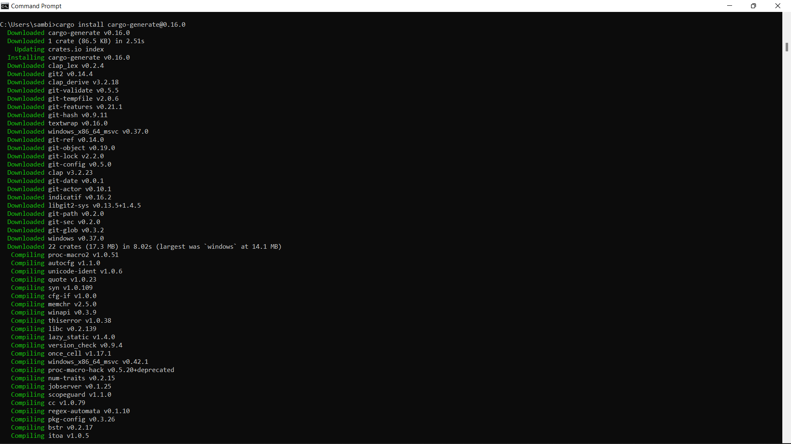
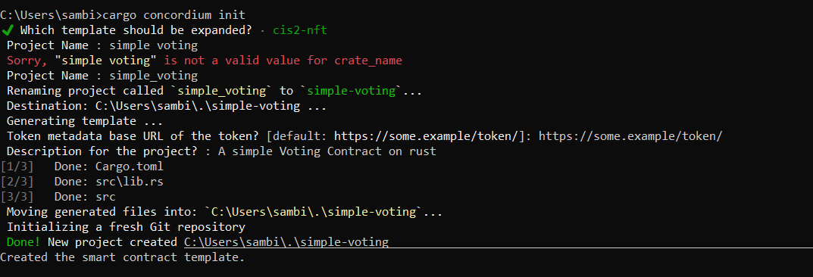
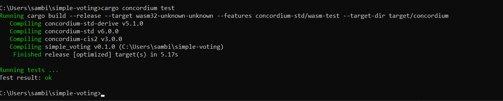
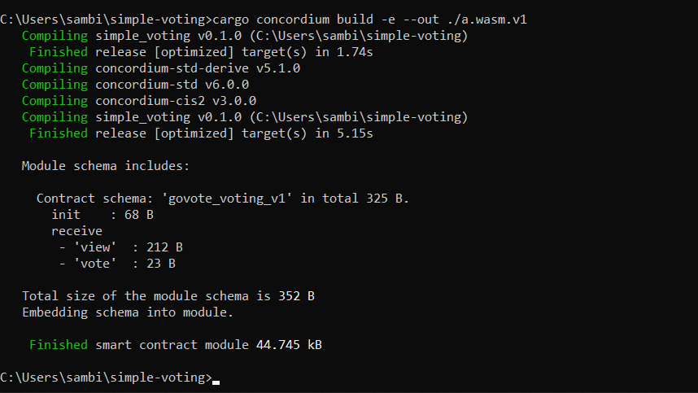
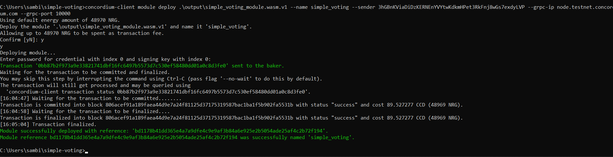

# Concordium-Hackathon Task-2
# TASK 2 Deploy Your First-Smart Contract
## Mainnet Address: ```4f1fKZA4kT2s2knPHUJ2addLDpwH7kPe2SQQHrT8oY9S7eCP7F```
## Contract address: ```bd1178b41dd365e4a7a9dfe4c9e9af3b84a6e925e2b5054ade25af4c2b72f194```
### Transaction Hash: ```0bb87b2f973a9e33821741dbf16fc6497b5573d7c530ef58480dd01a0c8d3fe0```

## Steps
### Install the cargo genereate V0.16.0 

### Cargo init

### cargo concordium test

### cargo concordium build

### Deployment of Contract

```
Enter password for credential with index 0 and signing key with index 0:
Transaction '0bb87b2f973a9e33821741dbf16fc6497b5573d7c530ef58480dd01a0c8d3fe0' sent to the baker.
Waiting for the transaction to be committed and finalized.
You may skip this step by interrupting the command using Ctrl-C (pass flag '--no-wait' to do this by default).
The transaction will still get processed and may be queried using
  'concordium-client transaction status 0bb87b2f973a9e33821741dbf16fc6497b5573d7c530ef58480dd01a0c8d3fe0'.
[16:04:47] Waiting for the transaction to be committed........
Transaction is committed into block 806acef91a189faea44d9e7a24f81125d37175319587bac1ba1f5b902fa5531b with status "success" and cost 89.527277 CCD (48969 NRG).
[16:04:58] Waiting for the transaction to be finalized....
Transaction is finalized into block 806acef91a189faea44d9e7a24f81125d37175319587bac1ba1f5b902fa5531b with status "success" and cost 89.527277 CCD (48969 NRG).
[16:05:04] Transaction finalized.
Module successfully deployed with reference: 'bd1178b41dd365e4a7a9dfe4c9e9af3b84a6e925e2b5054ade25af4c2b72f194'.
Module reference bd1178b41dd365e4a7a9dfe4c9e9af3b84a6e925e2b5054ade25af4c2b72f194 was successfully named 'simple_voting'.
```
