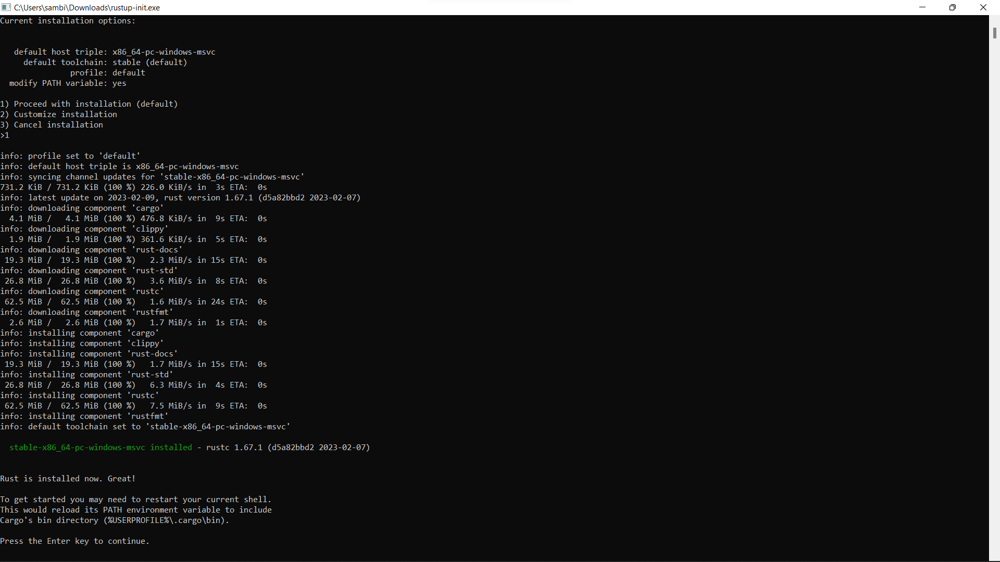
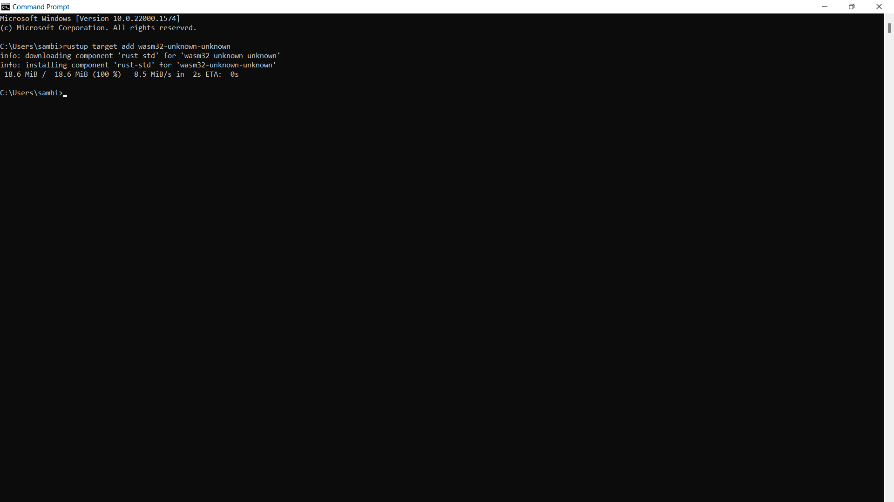
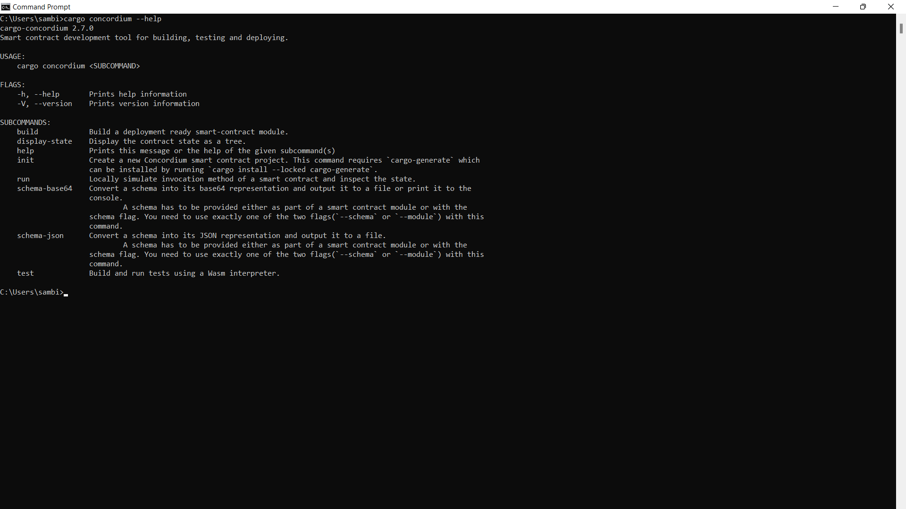
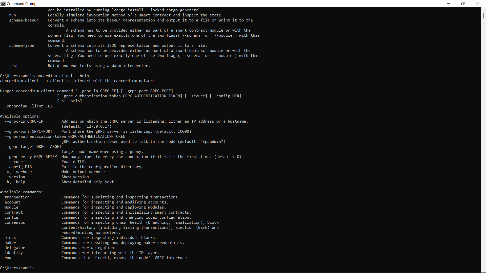
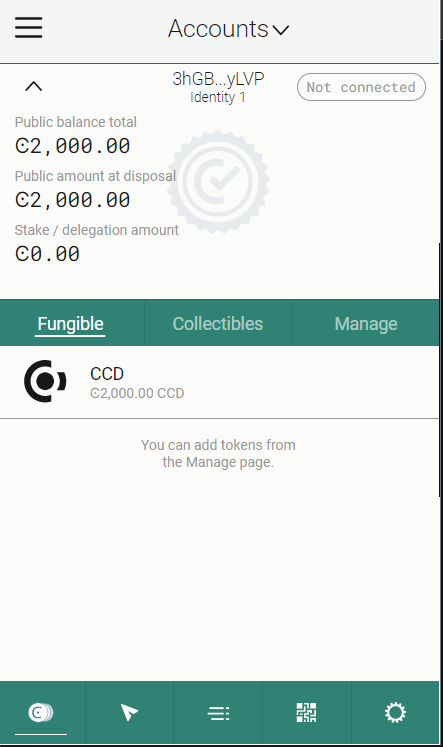
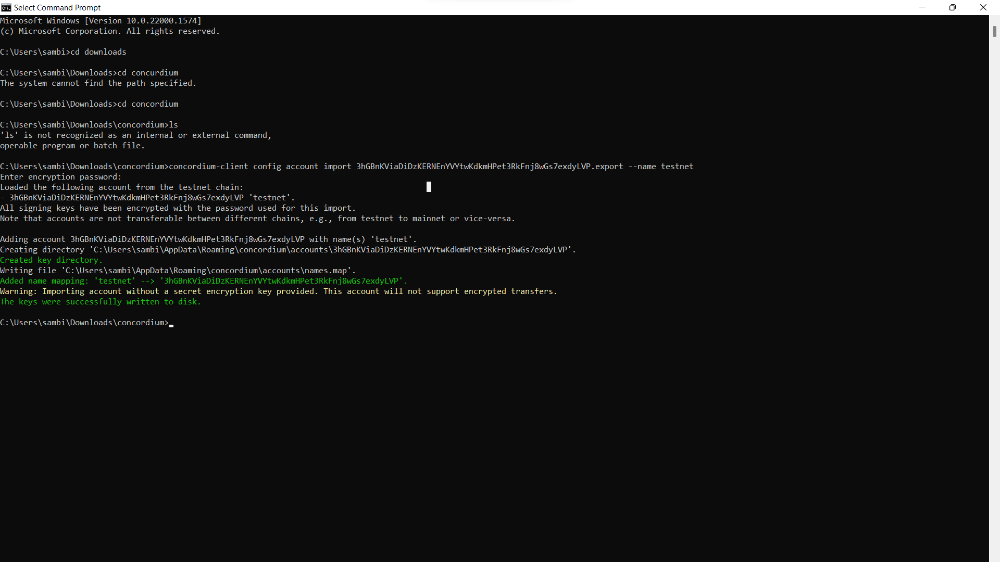

# Concordium-Hackathon Task-1
## This is a guide for developers to setup their environment for working with Concordium blockchain. Here are the steps:

1. **Install Rust**:
Rust is the programming language used to develop and deploy smart contracts on Concordium. Follow the instructions on the Rust website to install it.
## Install wasm: 

## Install cargo-concordium: 
Cargo-concordium is a command-line tool that lets us compile smart contracts, deploy them to the Concordium network, and manage accounts. To install cargo-concordium, follow the instructions provided.

## Install Concordium-client: 
Concordium-client is a graphical user interface that allows us to manage our accounts, transactions, and smart contracts. To install Concordium-client, visit the Concordium Github repository and download the latest release.

## Claimed Testnet

## Export the account from the web wallet and import it into Concordium client: 
To use Testnet account with Concordium-client, us need to export it from the web wallet and import it into Concordium-client. Follow the instructions on the Concordium documentation to learn how to do this.

